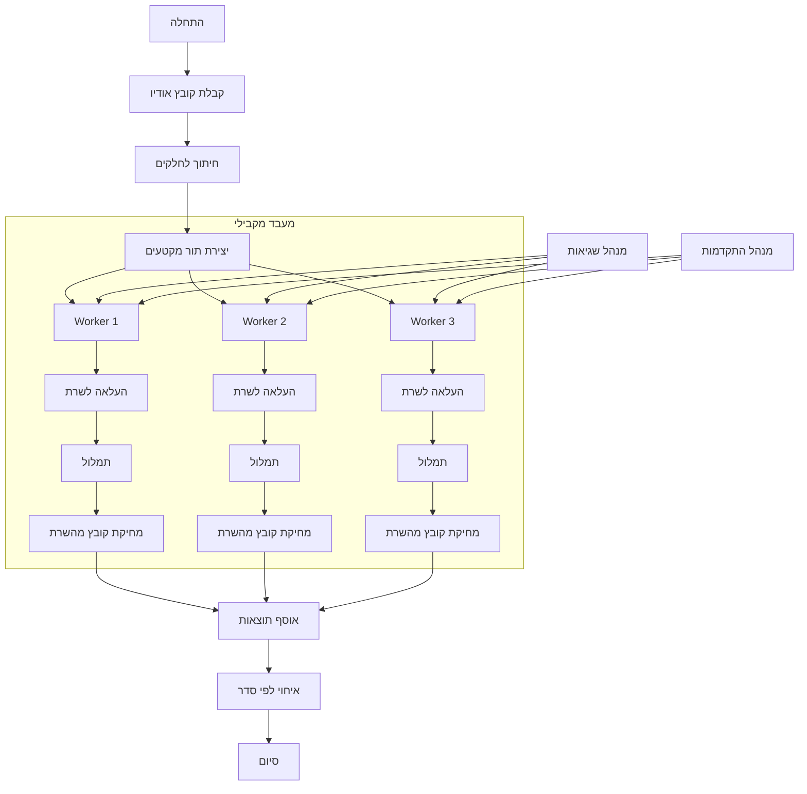

# תרשים זרימה - תמלול מקבילי

## רכיבי המערכת

### מנהל תור מקטעים
- מקבל את כל המקטעים ומנהל את התור
- מגביל את מספר העיבודים המקבילים לפי הקונפיגורציה
- מחלק עבודה לעובדים פנויים

### Workers
- כל worker מטפל במקטע אחד בכל פעם
- מבצע את רצף הפעולות: העלאה -> תמלול -> מחיקה
- מדווח על התקדמות ושגיאות

### מנהל שגיאות
- מטפל בשגיאות ברמת ה-worker
- מנסה לבצע retry במקרה של כשל
- מעדכן את המשתמש על בעיות

### מנהל התקדמות
- מקבל עדכוני סטטוס מכל ה-workers
- מאחד את העדכונים לדיווח אחד למשתמש
- מציג התקדמות כוללת ופר-מקטע

### אוסף תוצאות
- שומר את התוצאות לפי סדר המקטעים המקורי
- מבצע איחוי של הטקסטים תוך שימוש בפונקציית stitch הקיימת

## יתרונות הארכיטקטורה
1. ניצול יעיל של משאבי המערכת
2. זמן עיבוד מהיר יותר
3. שליטה על מספר הבקשות המקבילות
4. טיפול מסודר בשגיאות
5. שמירה על סדר המקטעים בתוצאה הסופית